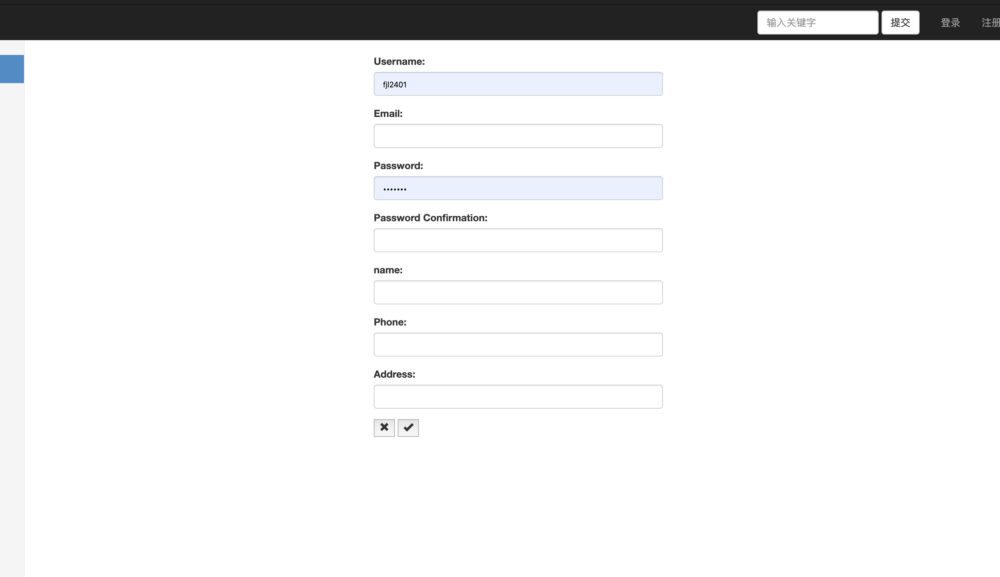
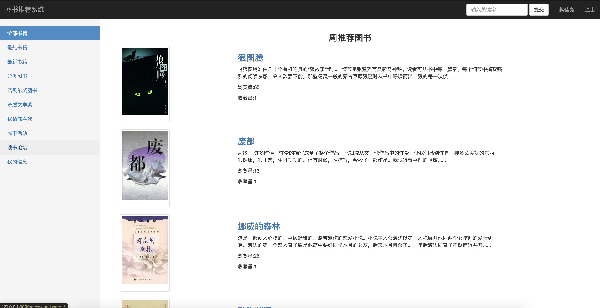

# 毕业设计--基于Django的图书推荐系统和论坛

拉取项目后，启动项目步骤如下

## 1、修改book/settings.py中的数据库名称

```
先在本地mysql创建一个名为bookmaster的数据库
然后按以下图片所示找到相应位置，修改连接mysql的用户名与密码
```


## 2、创建虚拟环境

```
使用pycharm创建虚拟环境
打开pycharm,依次点击左上角File->settings->Project:book-master->Project Interpreter
```


## 3、安装依赖库

```
打开Pycharm左下角的Terminal
输入命令
pip install -r requirements.txt

```

## 4、创建表数据迁移

```
打开pycharm左上角的Tools->Run manage.py Task
依次输入命令
makemigrations
migrate

```

等数据迁移完成后，创建超级管理员用于登录后台管理系统

```
打开pycharm左上角的Tools->Run manage.py Task
输入命令
createsuperuser
```

## 5、上架图书

```
打开Pycharm左下角的Terminal
输入命令
python manage.py runserver
```

然后打开浏览器

```
输入地址
http://127.0.0.1:8000/admin/
```


## 6、进入用户访问界面

打开浏览器

```
输入地址
http://127.0.0.1:8000/
```

至此，整个项目运行完成


## feature

1.	登录注册页面
2.	基于协同过滤的图书的分类，排序，搜索，打分功能
3.	基于协同过滤的周推荐和月推荐

4. 读书分享会等活动功能，用户报名功能
5. 发帖留言论坛功能


## fixed

1. 首页导航栏链接错误
2. 首页面为空
3. 登录注册页面
4. 推荐跳转登录
5. 周推荐用户没有评分时随机推荐
6. 按照收藏数量排序
7. 重新设计了 action 和UserAction model，拆分出了UserAction


## 书模型

1. 浏览量 每次刷新页面的浏览数
2. 收藏量 user manytomany field 每个用户收藏一次
3. 评分   rate 每个用户评分一次
4. 在书籍下面的评论加点赞功能

### 注册和登录





### 推荐


### 论坛


### 周推荐





